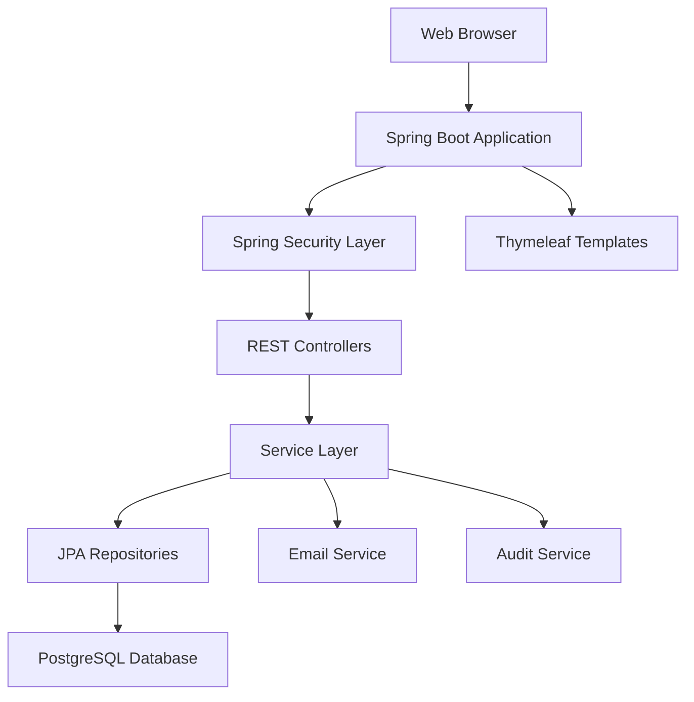

# Workflow Management Tool 🔄

[](https://spring.io/projects/spring-boot)
[](https://www.oracle.com/java/technologies/javase/jdk17-archive-downloads.html)
[](https://www.postgresql.org/)
[](https://gradle.org/)
[](LICENSE)

A comprehensive Spring Boot application designed to automate and manage internal business workflows such as leave requests, approvals, expense claims, and other organizational processes. Built with a focus on role-based access control, REST API architecture, and seamless integration capabilities.

## 🚀 Features

### 🔐 **User Management**
- **Role-based Authentication**: Admin, Manager, and Employee roles
- **Basic Authentication** with Spring Security
- **User Registration & Profile Management**
- **Secure Password Encoding** with BCrypt

### 📋 **Workflow Management**
- **Custom Workflow Creation**: Define multi-step approval processes
- **Dynamic Step Assignment**: Assign workflow steps to specific users
- **Workflow Progress Tracking**: Monitor execution status in real-time
- **Template-based Workflows**: Reusable workflow templates

### ✅ **Task Management**
- **Automated Task Generation**: Tasks created from workflow steps
- **Status Tracking**: Pending → In Progress → Completed → Rejected
- **User Assignment**: Role-based task assignment
- **Due Date Management**: Set and track task deadlines

### 📊 **Analytics & Reporting**
- **Performance Metrics**: Average approval times and bottleneck detection
- **Dashboard Analytics**: Pending vs completed task statistics
- **Audit Trail**: Complete activity logging for compliance

### 🔔 **Notifications**
- **Email Integration**: Automated notifications for task assignments
- **Status Updates**: Real-time notifications for workflow progress
- **Configurable SMTP**: Support for various email providers

## 🏗️ Architecture



### **Technology Stack**
- **Backend**: Spring Boot 3.3.3, Spring Security, Spring Data JPA
- **Frontend**: Thymeleaf, HTML5, CSS3, JavaScript (ES6)
- **Database**: PostgreSQL
- **Build Tool**: Gradle
- **Authentication**: Basic Authentication
- **Email**: Spring Mail with SMTP support

## 📚 API Documentation

### **Authentication**
All API endpoints require Basic Authentication with username:password in the Authorization header.

### **Core Endpoints**

| Method | Endpoint | Description | Role Required |
|--------|----------|-------------|---------------|
| `GET` | `/users` | List all users | Admin |
| `POST` | `/users` | Create new user | Admin |
| `PUT` | `/users/{id}` | Update user | Admin |
| `DELETE` | `/users/{id}` | Delete user | Admin |
| `GET` | `/workflows` | List workflows | All |
| `POST` | `/workflows` | Create workflow | Admin, Manager |
| `GET` | `/workflows/{id}` | Get workflow details | All |
| `GET` | `/tasks` | List user tasks | All |
| `PUT` | `/tasks/{id}/status` | Update task status | All |
| `GET` | `/analytics/approval-time` | Get approval metrics | Admin, Manager |
| `GET` | `/analytics/pending-vs-completed` | Get task statistics | Admin, Manager |

### **Sample API Usage**

```bash
# Login and get user info
curl -u username:password http://localhost:8080/users/me

# Create a new workflow
curl -u admin:admin123 -X POST http://localhost:8080/workflows \
  -H "Content-Type: application/json" \
  -d '{
    "name": "Leave Approval",
    "description": "Employee leave request workflow",
    "steps": [
      {
        "stepName": "Manager Review",
        "assignedToUserId": 2,
        "order": 1
      },
      {
        "stepName": "HR Approval",
        "assignedToUserId": 3,
        "order": 2
      }
    ]
  }'

# Update task status
curl -u employee:password -X PUT http://localhost:8080/tasks/1/status \
  -H "Content-Type: application/json" \
  -d '{"status": "COMPLETED"}'
```

## 🚀 Quick Start

### **Prerequisites**
- Java 17 or higher
- PostgreSQL 12+ 
- Gradle 7+ (or use included wrapper)

### **Database Setup**
```sql
-- Create database
CREATE DATABASE workflow_db;

-- Create user (optional)
CREATE USER workflow_user WITH PASSWORD 'your_password';
GRANT ALL PRIVILEGES ON DATABASE workflow_db TO workflow_user;
```

### **Installation**

1. **Clone the repository**
   ```bash
   git clone https://github.com/Imran8125/internal-workflow.git
   cd internal-workflow
   ```

2. **Configure database connection**
   ```yaml
   # src/main/resources/application.yml
   spring:
     datasource:
       url: jdbc:postgresql://localhost:5432/workflow_db
       username: your_username
       password: your_password
   ```

3. **Build and run**
   ```bash
   # Using Gradle wrapper (recommended)
   ./gradlew bootRun
   
   # Or using installed Gradle
   gradle bootRun
   ```

4. **Access the application**
   - Web Interface: http://localhost:8080
   - API Base URL: http://localhost:8080
   - Default Admin: `admin` / `admin123`

### **Environment Variables**
```bash
# Database Configuration
DB_URL=jdbc:postgresql://localhost:5432/workflow_db
DB_USERNAME=postgres
DB_PASSWORD=your_password

# Email Configuration
MAIL_HOST=smtp.gmail.com
MAIL_PORT=587
MAIL_USERNAME=your_email@gmail.com
MAIL_PASSWORD=your_app_password
MAIL_SMTP_AUTH=true
MAIL_SMTP_STARTTLS=true
```

## 📖 Usage Examples

### **Creating a Workflow**
1. Login as Admin or Manager
2. Navigate to `/app/workflows`
3. Click "Create Workflow"
4. Define steps and assign users
5. Submit to create workflow

### **Processing Tasks**
1. Login with assigned user credentials
2. View tasks at `/app/tasks`
3. Click on a task to view details
4. Update status: In Progress → Complete/Reject

### **Analytics Dashboard**
- Access `/app/analytics` (Admin/Manager only)
- View approval time metrics
- Monitor pending vs completed tasks
- Identify workflow bottlenecks

## 🗃️ Database Schema

```sql
-- Core Tables
users (id, username, password, email, role)
workflows (id, name, description, created_by, created_at)
workflow_steps (id, workflow_id, step_name, assigned_to, step_order)
tasks (id, workflow_id, step_id, status, assigned_user, due_date)
audit_logs (id, action, user_id, timestamp, details)
```

## 🔒 Security Features

- **Basic Authentication** with Spring Security
- **Role-based Access Control** (RBAC)
- **Method-level Security** with `@PreAuthorize`
- **Password Encryption** using BCrypt
- **CSRF Protection** enabled
- **Secure Headers** configuration

## 🧪 Testing

```bash
# Run all tests
./gradlew test

# Run with coverage
./gradlew test jacocoTestReport

# Integration tests
./gradlew integrationTest
```

## 📦 Deployment

### **Docker Deployment**
```dockerfile
FROM openjdk:17-jdk-slim
COPY build/libs/internal-workflow-*.jar app.jar
EXPOSE 8080
ENTRYPOINT ["java", "-jar", "/app.jar"]
```

```bash
# Build and run with Docker
docker build -t internal-workflow .
docker run -p 8080:8080 -e DB_URL=jdbc:postgresql://host.docker.internal:5432/workflow_db internal-workflow
```

### **Production Considerations**
- Use environment-specific `application-prod.yml`
- Configure proper logging levels
- Set up database connection pooling
- Enable HTTPS with SSL certificates
- Configure external email service (SendGrid, AWS SES)

## 🛠️ Development

### **Project Structure**
```
src/main/java/com/internalworkflow/
├── domain/              # Entity classes
├── repository/          # JPA repositories
├── service/            # Business logic
├── web/
│   ├── api/            # REST controllers
│   └── AppController   # Thymeleaf controllers
└── config/             # Configuration classes

src/main/resources/
├── application.yml     # Configuration
├── templates/          # Thymeleaf templates
└── static/            # CSS, JS, images
```

### **Adding New Features**
1. Create domain entity in `domain/`
2. Add repository in `repository/`
3. Implement service in `service/`
4. Create REST controller in `web/api/`
5. Add Thymeleaf template if needed

## 🤝 Contributing

1. Fork the repository
2. Create a feature branch (`git checkout -b feature/amazing-feature`)
3. Commit your changes (`git commit -m 'Add amazing feature'`)
4. Push to the branch (`git push origin feature/amazing-feature`)
5. Open a Pull Request

## 📝 License

This project is licensed under the MIT License - see the [LICENSE](LICENSE) file for details.

## 👥 Authors

- **Imran** - *Initial work* - [@Imran8125](https://github.com/Imran8125)

## 🙏 Acknowledgments

- Spring Boot team for the excellent framework
- PostgreSQL community for the robust database
- Contributors who help improve this project

## 📞 Support

If you have any questions or need help with setup:

- 📧 Email: [your-email@example.com]
- 🐛 Issues: [GitHub Issues](https://github.com/Imran8125/internal-workflow/issues)
- 📖 Documentation: [Wiki](https://github.com/Imran8125/internal-workflow/wiki)

---

<p align="center">
  <strong>Built with ❤️ using Spring Boot</strong>
</p>
